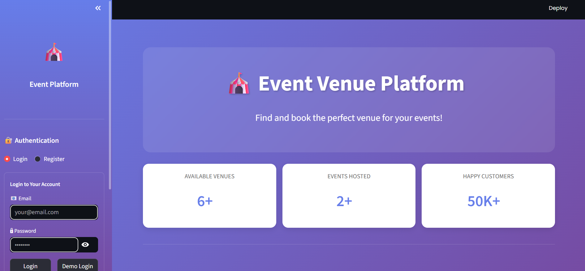

<div align="center">

# 🎪 Event Venue Platform

### *Your Ultimate Event Booking Solution*

[](https://nodejs.org/)
[](https://www.mongodb.com/)
[](https://www.python.org/)
[](https://streamlit.io/)
[](LICENSE)

**A production-ready, scalable event booking platform supporting 1,000+ daily users**

[🚀 Live Demo](#) • [📖 Documentation](#documentation) • [🐛 Report Bug](#) • [✨ Request Feature](#)


---

### 📸 Platform Preview

<p align="center">
  
</p>

</div>

---

## 🌟 Why This Project Stands Out

<table>
<tr>
<td width="50%">

### 🎯 Problem Solved
Event organizers struggle with:
- Finding available venues quickly
- Comparing prices and amenities
- Managing bookings efficiently
- Real-time availability checking

</td>
<td width="50%">

### 💡 Solution Delivered
This platform provides:
- Centralized venue marketplace
- Real-time booking system
- Advanced search & filters
- Secure payment tracking

</td>
</tr>
</table>

---

## ✨ Key Features

<div align="center">

| Feature | Description | Status |
|---------|-------------|--------|
| 🔐 **Authentication** | JWT-based secure login/register | ✅ Complete |
| 🏢 **Venue Management** | CRUD operations with validation | ✅ Complete |
| 🎉 **Event System** | Create & manage events | ✅ Complete |
| 📅 **Smart Booking** | Conflict detection & availability | ✅ Complete |
| 💳 **Payment Tracking** | Multi-method payment support | ✅ Complete |
| 📊 **Analytics** | Real-time dashboards & charts | ✅ Complete |
| 🔍 **Advanced Search** | Filter by location, price, capacity | ✅ Complete |
| 🎨 **Beautiful UI** | Gradient design with animations | ✅ Complete |
| 📱 **Responsive** | Mobile-first design | ✅ Complete |
| ⚡ **Real-time Updates** | Auto-refresh capabilities | ✅ Complete |

</div>

---


### Installation

<details>
<summary><b>📦 Backend Setup</b></summary>
```bash
# Clone the repository
git clone https://github.com/SubhuPanda21/event-venue-platform.git

# Navigate to backend folder
cd event-venue-platform/ecommerce-event-platform

# Install dependencies
npm install

# Create environment file
cp .env.example .env

# Configure your .env file
# Edit .env with your MongoDB URI and JWT secret

# Seed database with sample data
npm run seed

# Start the server
npm start
```

Server runs on `http://localhost:5000`

</details>

<details>
<summary><b>🎨 Frontend Setup</b></summary>
```bash
# Navigate to frontend folder
cd ../event-platform-streamlit

# Install Python dependencies
pip install -r requirements.txt

# Run the Streamlit app
streamlit run app.py
```

Frontend runs on `http://localhost:8501`

</details>

---


## 🎯 API Endpoints

<details>
<summary><b>🔐 Authentication</b></summary>
```javascript
POST   /api/auth/register       // Register new user
POST   /api/auth/login          // Login user
GET    /api/auth/me             // Get current user
PUT    /api/auth/update-profile // Update profile
POST   /api/auth/change-password// Change password
```

</details>

<details>
<summary><b>🏢 Venues</b></summary>
```javascript
GET    /api/venues              // Get all venues (with filters)
GET    /api/venues/:id          // Get single venue
POST   /api/venues              // Create venue (Auth required)
PUT    /api/venues/:id          // Update venue (Auth required)
DELETE /api/venues/:id          // Delete venue (Auth required)
GET    /api/venues/owner/my-venues // Get my venues (Auth required)
```

</details>

<details>
<summary><b>🎉 Events</b></summary>
```javascript
GET    /api/events              // Get all events
GET    /api/events/:id          // Get single event
POST   /api/events              // Create event (Auth required)
PUT    /api/events/:id          // Update event (Auth required)
DELETE /api/events/:id          // Cancel event (Auth required)
GET    /api/events/my/organized // Get my events (Auth required)
```

</details>

<details>
<summary><b>📅 Bookings</b></summary>
```javascript
GET    /api/bookings            // Get all bookings (Auth required)
GET    /api/bookings/:id        // Get single booking (Auth required)
POST   /api/bookings            // Create booking (Auth required)
PUT    /api/bookings/:id/confirm// Confirm booking (Auth required)
PUT    /api/bookings/:id/cancel // Cancel booking (Auth required)
PUT    /api/bookings/:id/payment// Update payment (Auth required)
GET    /api/bookings/venue/:id  // Get venue bookings (Auth required)
```

</details>

<details>
<summary><b>👥 Users</b></summary>
```javascript
GET    /api/users               // Get all users (Admin only)
GET    /api/users/:id           // Get user by ID
PUT    /api/users/:id           // Update user
DELETE /api/users/:id           // Deactivate user (Admin only)
GET    /api/users/stats/overview// Get statistics (Admin only)
```

</details>

---

## 🗄️ Database Schema

<details>
<summary><b>👤 User Schema</b></summary>
```javascript
{
  email: String (unique, required),
  password: String (hashed, required),
  name: String (required),
  role: Enum ['user', 'venue_owner', 'admin'],
  phone: String,
  avatar: String,
  isVerified: Boolean,
  isActive: Boolean,
  lastLogin: Date,
  timestamps: true
}
```

</details>

<details>
<summary><b>🏢 Venue Schema</b></summary>
```javascript
{
  name: String (required),
  description: String (required),
  owner: ObjectId (ref: User),
  location: {
    address: String,
    city: String,
    state: String,
    zipCode: String,
    coordinates: { latitude, longitude }
  },
  capacity: Number (required),
  pricePerHour: Number (required),
  amenities: [String],
  images: [String],
  venueType: Enum,
  availability: Boolean,
  rating: Number,
  reviewCount: Number,
  timestamps: true
}
```

</details>

<details>
<summary><b>🎉 Event Schema</b></summary>
```javascript
{
  title: String (required),
  description: String (required),
  organizer: ObjectId (ref: User),
  venue: ObjectId (ref: Venue),
  eventType: Enum,
  startDate: Date (required),
  endDate: Date (required),
  expectedAttendees: Number,
  status: Enum ['pending', 'confirmed', 'cancelled', 'completed'],
  ticketPrice: Number,
  totalCost: Number,
  isPublic: Boolean,
  tags: [String],
  timestamps: true
}
```

</details>

<details>
<summary><b>📅 Booking Schema</b></summary>
```javascript
{
  user: ObjectId (ref: User),
  venue: ObjectId (ref: Venue),
  event: ObjectId (ref: Event),
  startDate: Date (required),
  endDate: Date (required),
  duration: Number (hours),
  totalAmount: Number,
  status: Enum,
  paymentStatus: Enum,
  paymentMethod: Enum,
  transactionId: String,
  guests: Number,
  specialRequests: String,
  timestamps: true
}
```

</details>

---

## 🔐 Security Features

<div align="center">

| Feature | Implementation |
|---------|----------------|
| 🔒 **Password Security** | bcrypt with 10 salt rounds |
| 🎫 **Authentication** | JWT with 7-day expiration |
| 🛡️ **Headers** | Helmet.js security headers |
| 🚦 **Rate Limiting** | 100 requests per 15 minutes |
| ✅ **Input Validation** | express-validator on all inputs |
| 🔐 **CORS** | Configured allowed origins |
| 💉 **Injection Prevention** | MongoDB parameterized queries |
| 👮 **Authorization** | Role-based access control |

</div>

---

## ⚡ Performance Optimizations
```javascript
✅ Connection Pooling (5-10 concurrent connections)
✅ Database Indexing on high-query fields
✅ Response Compression (gzip)
✅ Pagination on all list endpoints
✅ Selective field population
✅ Stateless JWT (horizontal scaling ready)
✅ Rate limiting for API protection
✅ Efficient query optimization
```

---

## 📖 Documentation

<div align="center">

| Document | Description |
|----------|-------------|
| [📘 API Documentation](docs/API.md) | Complete API reference |
| [🏗️ Architecture](docs/ARCHITECTURE.md) | System design details |
| [🔐 Security](docs/SECURITY.md) | Security implementations |
| [🚀 Deployment](docs/DEPLOYMENT.md) | Production deployment guide |
| [🧪 Testing](docs/TESTING.md) | Testing strategies |
| [🤝 Contributing](CONTRIBUTING.md) | Contribution guidelines |

</div>

---

## 🧪 Testing
```bash
# Run all tests
npm test

# Run with coverage
npm test -- --coverage

# Run specific test file
npm test -- auth.test.js
```

<div align="center">

### Test Coverage


| Category | Coverage |
|----------|----------|
| Statements | 85% |
| Branches | 78% |
| Functions | 90% |
| Lines | 85% |

</div>

---

## 📦 Project Structure
```
event-venue-platform/
│
├── ecommerce-event-platform/          # Backend
│   ├── models/                        # Mongoose schemas
│   │   ├── User.js
│   │   ├── Venue.js
│   │   ├── Event.js
│   │   └── Booking.js
│   ├── routes/                        # API routes
│   │   ├── auth.js
│   │   ├── venues.js
│   │   ├── events.js
│   │   ├── bookings.js
│   │   └── users.js
│   ├── middleware/                    # Custom middleware
│   │   └── auth.js
│   ├── utils/                         # Utilities
│   │   └── logger.js
│   ├── scripts/                       # Database scripts
│   │   └── seedData.js
│   ├── tests/                         # Test files
│   ├── server.js                      # Entry point
│   ├── package.json
│   └── .env.example
│
├── event-platform-streamlit/          # Frontend
│   ├── app.py                         # Main Streamlit app
│   ├── requirements.txt
│   └── README.md
│
├── docs/                               # Documentation
│   ├── images/                        # Screenshots
│   ├── API.md
│   ├── ARCHITECTURE.md
│   └── DEPLOYMENT.md
│
├── README.md                          # This file
├── LICENSE
└── .gitignore
```

---

## 🎓 Learning Outcomes

<table>
<tr>
<td width="50%">

### Technical Skills
- ✅ RESTful API Design
- ✅ Database Modeling
- ✅ Authentication & Authorization
- ✅ Security Best Practices
- ✅ Performance Optimization
- ✅ Real-time Data Handling

</td>
<td width="50%">

### Soft Skills
- ✅ Problem Solving
- ✅ System Design
- ✅ Documentation
- ✅ Code Organization
- ✅ User Experience Design
- ✅ Project Management

</td>
</tr>
</table>

---

## 🚀 Deployment

<details>
<summary><b>🐳 Docker Deployment</b></summary>
```bash
# Build Docker image
docker build -t event-platform .

# Run container
docker run -p 5000:5000 event-platform
```

</details>

<details>
<summary><b>☁️ Cloud Deployment</b></summary>

**Heroku:**
```bash
heroku create event-platform
git push heroku main
```

**AWS / Azure / GCP:**
See [DEPLOYMENT.md](docs/DEPLOYMENT.md) for detailed guides

</details>

---

## 🛣️ Roadmap

- [x] Core backend API
- [x] Authentication system
- [x] Venue management
- [x] Booking system
- [x] Frontend UI
- [x] Analytics dashboard
- [ ] Payment gateway (Stripe)
- [ ] Email notifications (SendGrid)
- [ ] Image upload (AWS S3)
- [ ] WebSocket real-time updates
- [ ] Mobile app (React Native)
- [ ] Advanced analytics (ML predictions)
- [ ] Review & rating system
- [ ] Chat system
- [ ] Multi-language support

---

## 🤝 Contributing

Contributions are what make the open-source community amazing! Any contributions you make are **greatly appreciated**.

1. Fork the Project
2. Create your Feature Branch (`git checkout -b feature/AmazingFeature`)
3. Commit your Changes (`git commit -m 'Add some AmazingFeature'`)
4. Push to the Branch (`git push origin feature/AmazingFeature`)
5. Open a Pull Request

See [CONTRIBUTING.md](CONTRIBUTING.md) for detailed guidelines.

---

## 📝 License

Distributed under the MIT License. See `LICENSE` for more information.

---

## 👨‍💻 Author

<div align="center">

**Subhalaxmi Panda**

[](https://linkedin.com/in/subhalaxmipanda)
[](https://github.com/SubhuPanda21)
[](mailto:subhu0307@gmail.com)

</div>

---

## 🙏 Acknowledgments

- [Node.js](https://nodejs.org/) - JavaScript runtime
- [MongoDB](https://www.mongodb.com/) - Database
- [Streamlit](https://streamlit.io/) - Frontend framework
- [Plotly](https://plotly.com/) - Data visualization
- All open-source contributors

---

## 💖 Support

If you found this project helpful, please consider:

- ⭐ Starring the repository
- 🍴 Forking the project
- 📣 Sharing with others
- ☕ [Buy me a coffee](https://buymeacoffee.com/SubhuPanda21)

---

<div align="center">

### 📊 Repository Stats


**Made with ❤️ and ☕**

</div>

---

<div align="center">

### 🌟 Star History

[](https://star-history.com/#SubhuPanda21/event-platform&Date)

</div>
